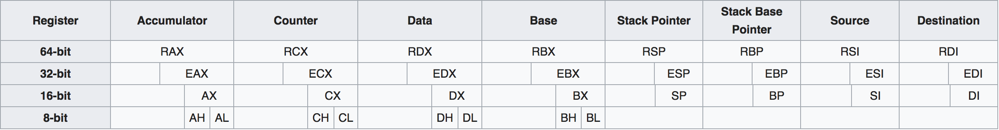

# 微处理器管理模式(8086)

### 通用寄存器&段寄存器

| 通用寄存器 | 作用                                                |
| ----- | ------------------------------------------------- |
| AX    | the accumulator register (divided into AH / AL).  |
| BX    | the base address register (divided into BH / BL). |
| CX    | the count register (divided into CH / CL).        |
| DX    | the data register (divided into DH / DL).         |
| BP    | base pointer.                                     |
| DI    | destination index register.                       |
| SI    | source index register.                            |
| SP    | stack pointer.                                    |

| 段寄存器 | 作用                                                                                                         |
| ---- | ---------------------------------------------------------------------------------------------------------- |
| CS   | points at the segment containing the current program                                                       |
| DS   | generally points at segment where variables are defined                                                    |
| ES   | extra segment register, it’s up to a coder to define its usage. ES is used as a temporary segment register |
| SS   | points at the segment containing the stack                                                                 |

### 标志寄存器

| 标志寄存器 | 作用                     |
| ----- | ---------------------- |
| CF    | 进位标志（最高位）              |
| OF    | 溢出标志（检测带符号数运算是否发生溢出）   |
| ZF    | 零标志                    |
| SF    | 符号标志（结果为负SF=1）         |
| AF    | 辅助进位标志（最低4位有进位或借位AF=1） |
| PF    | 结果中二进制位数的奇偶（偶数PF=1）    |
| IF    | 中断允许标志                 |
| DF    | 方向标志                   |
| TF    | 陷阱标志                   |

<figure><figcaption></figcaption></figure>

```armasm
MOV AL, 80H
MOV AL, -128
```

在计算机中因为是补码表示，`AL`的值是相同的

```
80H  -> 1000000
-128 -> 1000000
```

### 实模式

在8086中，`CS`和`IP`共同构成代码段寻址访问，`CS * 0x10H + IP`

`DS`同理

<figure><figcaption></figcaption></figure>

<figure><figcaption></figcaption></figure>

### 保护模式

#### 段选择符

在保护模式下，段寄存器存放一个**索引**，称为**段选择符**，段选择符从全局描述符表或局部描述符中找到8个字节长的段描述符

<figure><figcaption></figcaption></figure>

0-1位存放RPL，表示将要访问的段的特权级0\~3

2位存放TI，表示从GDT（全局描述符表）还是LDT（局部描述符表）中选择描述符

3-15位存放Index，表示将要访问描述符在描述符表中的顺序号，最多有$$2^{13}=8192$$个描述符

#### 全局描述符表

全局描述符表（Global Descriptor Table，GDT），定义全局存储器空间的一个机制，用**段描述符**来描述一个全局存储器中的段。每个GDT最多有$$2^{13}=8192$$​个描述符

#### 全局描述符表寄存器

全局描述表寄存器（Global Descriptor Table Register，GDTR），定义全局描述符表的基址和限长

<figure><figcaption></figcaption></figure>

#### 局部描述符表

局部描述符表（Local Descriptor Table，LDT），定义某项任务用到的局部存储器地址空间。多任务环境下，每项任务都有自己的LDT。

#### 局部描述符表寄存器

局部描述符表寄存器（Local Descriptor Table Register，LDTR）与GDTR不同

LDTR的内容是LDT描述符在GDT中的索引，先由GDTR确定GDT基地，再从LDTR得到LDT描述符在GDT中的位置，最后从LDT描述符中得到LDT的基地和限长

<figure><figcaption></figcaption></figure>

#### 保护模式下的寻址

保护模式下寻址通过CS(16):EIP(32)，得到的地址是虚拟地址，一共48位，有效位46位

<figure><figcaption></figcaption></figure>

#### 段描述符

<figure><figcaption></figcaption></figure>

#### 虚拟地址到物理地址

<figure><figcaption></figcaption></figure>

### 页式内存管理

#### 分页

分段管理更加精确来减少内存浪费，但是每次都需要将段全部装入内存，全部从内存释放，效率很低。

分页管理会将那些被需要的页装入内存，更加灵活。

假设每页大小为4KB，分页管理由三项构成：页目录表、页表、页面

<figure><figcaption></figcaption></figure>

页目录表存储页表的索引，页表存储页面的索引，页面存储物理地址

32位地址中，31-22位（10位）记录页目录索引，21-12位（10位）记录页表索引，11-0位（12位）记录页面偏移量

#### 页表寻址

<figure><figcaption></figcaption></figure>

#### 中断描述符表寄存器

中断描述符表寄存器（Interrupt Descriptor Table Register，IDTR），48位寄存器。

低16位是限长，给出中断描述符表（IDT）的字节大小（其值比IDT的长度小1）

高32位是线性地址，指向IDT的基地址

<figure><figcaption></figcaption></figure>

### 为什么不用EIP直接指向虚拟地址？

为了确保**多任务**的安全性，单任务情况下EIP可以直接指向内存

### 任务

保护模式下，在任何时刻都有一个当前任务，由TR寄存器指定。

每个任务都由两个部分组成：任务执行环境（Task Executation Space，TES）、任务状态段（Task State Segment，TSS）

<figure><figcaption></figcaption></figure>

#### 任务状态段

<figure><figcaption></figcaption></figure>

TSS描述符放在GDT中；TR内容为选择符，指出TSS描述符在GDT中的顺序号

切换任务的时候，将CPU中各寄存器的当前值保存到TR所指定的TSS中，下一任务的TSS选择符装入TR

#### TR取得TSS过程

<figure><figcaption></figcaption></figure>

#### 任务切换

<figure><figcaption><p>直接任务切换</p></figcaption></figure>

<figure><figcaption><p>间接任务切换</p></figcaption></figure>

### 特权级检查

依据CPL、DPL、RPL来判断特权级是否满足要求：

$$
{\rm DPL} \geq max({\rm CPL,RPL})
$$

* CPL是**当前正在运行的程序的特权级** -> CS寄存器的最低两位
* DPL是**描述符特权级**，位于段描述符中，表明什么样的特权级程序可以使用这个段
* RPL是**请求特权级**（如果RPL大于CPL，当前程序降级和RPL匹配）

> 数字越大特权级越低

<figure><figcaption><p>特权级检查</p></figcaption></figure>

#### 对数据段的保护访问

<figure><figcaption></figcaption></figure>

#### 对程序的保护

对直接转移的保护

1. 同一代码段内转移时，CS不变，特权级不发生变化，只需要检查限长
2. 段间调用或跳转，检查限长、特权级CPL和DPL

* CPL=DPL，允许跳转和调用
* CPL\<DPL，禁止。高特权级不能转移到低特权级
* CPL>DPL，此时要检查段描述符的C位。如果C位为1，表示这是一致代码段，允许跳转和调用


作业：

* 2.5、2.11、2.12、2.15
* 汇编环境配置
