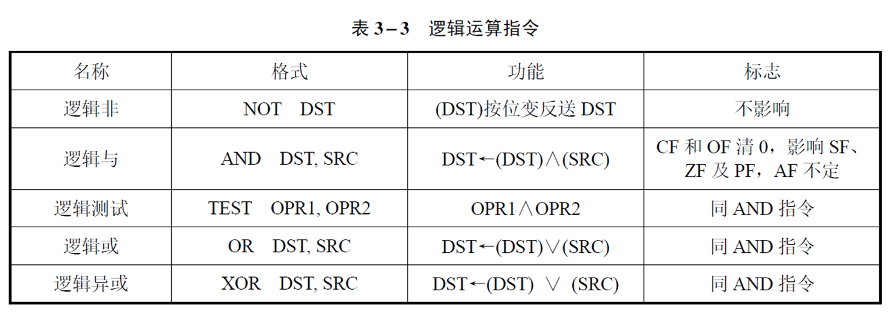

# 汇编语言与接口技术

### 基础

`2^10 = 1KB`

`2^20 = 1MB`

`2^30 = 1GB`

### 微处理器管理模式

#### 寄存器

| 通用寄存器 | 作用                                                |
| ----- | ------------------------------------------------- |
| AX    | the accumulator register (divided into AH / AL).  |
| BX    | the base address register (divided into BH / BL). |
| CX    | the count register (divided into CH / CL).        |
| DX    | the data register (divided into DH / DL).         |
| BP    | base pointer.                                     |
| DI    | destination index register.                       |
| SI    | source index register.                            |
| SP    | stack pointer.                                    |

| 段寄存器 | 作用 |
| ---- | -- |
| CS   |    |
| DS   |    |
| ES   |    |
| SS   |    |

```armasm
MOV AL, 80H
MOV AL, -128
```

在计算机中因为是补码表示，`AL`的值是相同的

```
80H  -> 1000000
-128 -> 1000000
```

在8086中，`CS`和`IP`共同构成代码段寻址访问，`CS * 0x10H + IP`

`DS`同理

<figure><figcaption></figcaption></figure>

